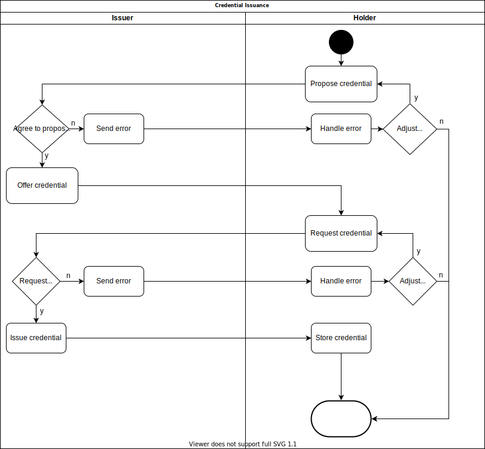
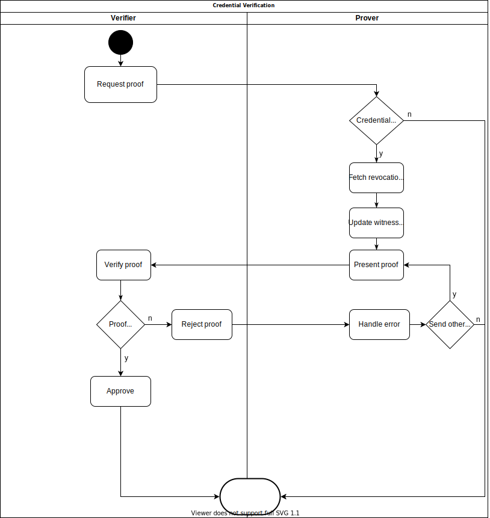

# Resources

* [Ursa anoncreds document (helpful explanations regarding various ZKP concepts)](https://github.com/hyperledger/ursa/blob/master/libursa/docs/anoncreds-design.md)

# Motivation

This document is heavily inspired by Indy's [credential issuance](https://github.com/hyperledger/aries-rfcs/tree/master/features/0036-issue-credentialhttps://github.com/hyperledger/aries-rfcs/tree/master/features/0036-issue-credential) workflows.
This is, not entirely but to a large part, due to the fact that we rely heavily on Ursa on this which assumes and dictates
these workflows.

# VC Schemas

VC schemas are JSON documents that describe the structure of a VC (available properties and their structure).
Read more about VC schemas [here](https://www.w3.org/TR/vc-data-model/#data-schemas).
Every user can create a schema by generating a DID and saving the schema under this DID.
The schema is then publicly accessible.

A VC may look like this:

```jsonc
{
  "@context": [ "https://www.w3.org/2018/credentials/v1" ],
  "type": [ "VerifiableCredential" ],
  "id": "vc:evan:testcore:0x6e90a3e2bf3823e52eceb0f81373eb58b1a0a238965f0d4388ab9ce9ceeddfd3",
  "issuer": {
    "id": "did:evan:testcore:0x96da854df34f5dcd25793b75e170b3d8c63a95ad"
  },
  "credentialSubject": {
    "id": "did:evan:testcore:0x67ce8b01b3b75a9ba4a1462139a1edaa0d2f539f",
    "data": [
      {
        "vehicleType": ["Car"],
        "issuedAt": "2020-04-23T18:00:00.000Z",
        "holder": "John Doe"
      }
    ]
  },
  "credentialSchema": {
    "id": "did:evan:schema:0x1ace8b01be3bca9ba4a1462130a1e0ad0d2f539f",
    "type": "EvanVCSchema"
  },
  // ...
}
```

And the according schema definition like this:

```jsonc

{
  "id":"did:evan:schema:0x1ace8b01be3bca9ba4a1462130a1e0ad0d2f539f",
  "type": "EvanVCSchema",
  "$schema": "http://json-schema.org/schema#",
  "name": "DriversLicenseSchemaV1",
  "author": "did:evan:testcore:0x96da854df34f5dcd25793b75e170b3d8c63a95ad",
  "createdAt": "2020-04-23T00:00:00.000Z",
  "description": "Schema for VCs issued to trusted suppliers",
  "properties": {
    "vehicleType": { "type": "array", "items": { "type": "string" } },
    "issuedAt": {"type": "string", "format": "date-time" },
    "holder": { "type": "string" }
  },
  "required": ["name", "vehicleType", "issuedAt"],
  "additionalProperties": false,
  "proof": {"..."} // proof that schema was created by author
}
```

## ZKP Credential Definitions

In addition to a schema, every issued ZKP also needs to reference a credential definition.
A credential definition provides the cryptographic material needed by a verifier to verify signatures and will be referenced in a credential's proof.
Additionally, a credential definition contains a revocation registry that holds the revocation status of every credential issued under the use of this credential definition.
The registry and the according revocation public key are needed by verifiers to validate the non-revocation proof presented by a prover.
The credential definition's proof property binds the credential definition to the issuer.
Every issuer needs to create at **least one credential definition per schema** they plan to issue.

```jsonc
{
  "id":"did:evan:zkp:0x81adc34df34f5dcd25793b9de170b3d8c63a95ad",
  "type": "EvanZKPCredentialDefinition",
  "issuer": "did:evan:testcore:0x96da854df34f5dcd25793b75e170b3d8c63a95ad",
  "schema": "did:evan:schema:0x1ace8b01be3bca9ba4a1462130a1e0ad0d2f539f",
  "createdAt": "2020-04-23T00:00:00.000Z",
  "publicKey": "<base64-encoded public key>",
  "publicKeyCorrectnessProof":"<base64-encoded correctness proof>",
  "proof": {
    "type": "EcdsaPublicKeySecp256k1",
    "created": "2020-04-23T00:01:00.000Z",
    "proofPurpose": "assertionMethod",
    "verificationMethod": "did:evan:testcore:0x96da854df34f5dcd25793b75e170b3d8c63a95ad#key-1",
    "jws": "<token>"
  }
}
```

# Credential Worfklow

## Schema Issuance

## Credential Issuance



#### 1. Credential Proposal

- A message sent by Holder to Issuer.
It initiates the workflow and lets Issuer know what kind of credential Holder hopes to receive.

```jsonc
{
  "issuer": "<DID of the issuer>",
  "subject": "did:evan:testcore:0x67ce8b01b3b75a9ba4a1462139a1edaa0d2f539f",
  "type": "EvanZKPCredentialProposal",
  "schema": "did:evan:schema:0x1ace8b01be3bca9ba4a1462130a1e0ad0d2f539f"
}
```

#### 2. Credential Offering

- A message sent by Issuer to Holder, upon receiving a credential proposal.
It provides Holder with the credential definition Issuer will use for generating the signature, and a nonce value.
These are required for the credential request.
If Issuer does not support the proposed schema or objects to issuing a credential to Holder, they send an error instead.

```jsonc
{
  "issuer": "<DID of the issuer>",
  "subject": "did:evan:testcore:0x67ce8b01b3b75a9ba4a1462139a1edaa0d2f539f",
  "type": "EvanZKPCredentialOffering",
  "schema": "did:evan:schema:0x1ace8b01be3bca9ba4a1462130a1e0ad0d2f539f",
  "credentialDefinition": "did:evan:zkp:0x81adc34df34f5dcd25793b9de170b3d8c63a95ad",
  "nonce": "<nonce>"
}
```

#### 3. Credential Request

- A message by Holder to Issuer in response to a credential offering.
Contains cryptographic material and information about the requested credential, such as the target schema, the Holder's DID and the values to be signed.
<-- Have the holder send the encoded values or let the issuer do this? -->

```jsonc
{
  "subject": "did:evan:testcore:0x67ce8b01b3b75a9ba4a1462139a1edaa0d2f539f",
  "schema": "did:evan:schema:0x1ace8b01be3bca9ba4a1462130a1e0ad0d2f539f",
  "credentialDefinition": "did:evan:zkp:0x81adc34df34f5dcd25793b9de170b3d8c63a95ad",
  "type": "EvanZKPCredentialRequest",
  "blindedCredentialSecrets": "<base64-encoded blinded secrets>",
  "blindedCredentialSecretsCorrectnessProof": "<base64-encoded correctness proof>",
  "credential_nonce": "<nonce>",
  "credential_values": {
      "vehicleType": {
          "raw": "[car]",
          "encoded": "392509354589"
        }
      },
      "issuedAt": {
          "raw": "2020-04-23T18:00:00.000Z",
          "value": "315036757630443117305318532964332690743304714495462653702192"

      },
      "holder": {
          "raw": "John Doe",
          "encoded": "5363620503418597221"
      }
    }
  }
}
```

#### 4. Credential Issuance

- A message sent by Issuer to Holder upon receiving a credential request.
If Issuer decides that the credential request is valid, they respond with a signed VC.
If Issuer objects to the credential request, e.g. because the provided nonce is incorrect, they sent an error message instead.

```jsonc
{
  "@context": [ "https://www.w3.org/2018/credentials/v1" ],
  "type": [ "VerifiableCredential" ],
  "id": "vc:evan:testcore:0x6e90a3e2bf3823e52eceb0f81373eb58b1a0a238965f0d4388ab9ce9ceeddfd3",
  "issuer": "did:evan:testcore:0x96da854df34f5dcd25793b75e170b3d8c63a95ad",
  "credentialSubject": {
    "id": "did:evan:testcore:0x67ce8b01b3b75a9ba4a1462139a1edaa0d2f539f",
    "data": { // This part is dependant on what the holder decides to disclose and is only derived from the revealed values of the ZKP signature
       "vehicleType": ["Car"],
        "issuedAt": "2020-04-23T18:00:00.000Z",
        "holder": "John Doe"
      }
  },
  "credentialSchema": {
    "id": "did:evan:schema:0x1ace8b01be3bca9ba4a1462130a1e0ad0d2f539f",
    "type": "EvanZKPSchema" // <!-- Tells the machine about this schema (aka metadata). Here we have two options. Either have a DID point to a metadata document describing
                                   // information about the schema, or have it hold the name of the schema, which is also included in the schema (which makes it kind of redundant/superfluous)
                                   // and include metadata in the schema itself -->
  },
  "proof": {
    "type": "CLSignature2019",
    "credentialDefinition": "did:evan:zkp:0x81adc34df34f5dcd25793b9de170b3d8c63a95ad",
    "signature": "<base64-encoded signature>",
    "signatureCorrectnessProof": "<base64-encoded correctness proof>",
    "issuanceNonce": "<nonce>",
    "revocationId": "241", // ID in the revocation registry. Needed for non-revocation proofs. Unique per credential.
    "revocationRegistryDefinition": "did:evan:zkp:0xf1c36a491c67a2946ba993601f2967d33726e0b6dd28ac676165d22a4e5633c5"
  }
}
```

#### Data exchange

The following images depict the data being exchanged and required for the credential issuance workflow

1. Issuance of a credential


## Verification



#### 5. Request Proof

- Verifier requests a proof from Prover (Holder).
A proof consists of one or more sub-proofs, each referencing a credential schema and a set of attributes of this schema the verifier needs to be revealed.

```jsonc
{
  "verifier": "did:evan:testcore:032ce9e8b01be3bca9ba4a1462130a1e0cg0d2f53f1",
  "createdAt": "2020-04-23T00:01:00.000Z",
  "nonce": "<nonce>",
  "subProofRequests": [
    {
      "schema": "did:evan:schema:0x1ace8b01be3bca9ba4a1462130a1e0ad0d2f539f",
      "revealedAttributes": ["driversLicense.issuedAt", "driversLicense.vehicleType"]
    }
  ]
}
```

#### 6. Present Proof

- Prover creates a new Verifiable Presentation (VP) that contains VCs each revealing the required attributes, and the proof.
It is important that the VCs are in the exact order the proof request commands.
This VC is sent to Verifier.

```jsonc
{
  "@context": [ "https://www.w3.org/2018/credentials/v1" ],
  "id": "vp:evan:testcore:0x77e0a3e2bf3823e52eceb0f813733158b1a0a238965f0ef198ab9ce9ceedd41a",
  "type": ["VerifiablePresentation", "CredentialManagerPresentation"],
  "verifiableCredential": [
    {
      "@context": [ "https://www.w3.org/2018/credentials/v1" ],
      "type": [ "VerifiableCredential" ],
      "id": "vc:evan:testcore:0x6e90a3e2bf3823e52eceb0f81373eb58b1a0a238965f0d4388ab9ce9ceeddfd3",
      "issuer": "did:evan:testcore:0x96da854df34f5dcd25793b75e170b3d8c63a95ad",
      "credentialSubject": {
        "id": "did:evan:testcore:0x67ce8b01b3b75a9ba4a1462139a1edaa0d2f539f",
        "data": {
            "vehicleType": ["Car"],
            "issuedAt": "2020-04-23T18:00:00.000Z"
          }
      },
      "credentialSchema": {
        "id": "did:evan:schema:0x1ace8b01be3bca9ba4a1462130a1e0ad0d2f539f",
        "type": "EvanZKPSchema"
      },
      "proof": {
        "credentialDefinition": "did:evan:zkp:0x81adc34df34f5dcd25793b9de170b3d8c63a95ad",
        "proof": "<base64-encoded proof object>",
      }
    },
  ],
  "proof": {
    "nonce": "<nonce>",
    "aggregatedProof": "<base64-encoded aggregated proof>"
  }
}
```

#### 7. Verify Proof

- Verifier acknowledges the VP and proceeds to perform an action or rejects it and refuses to perform any action.

```jsonc
{
  "presentedProof":  "vp:evan:testcore:0x77e0a3e2bf3823e52eceb0f813733158b1a0a238965f0ef198ab9ce9ceedd41a",
  "status": "verified"
}
```

or

```jsonc
{
  "presentedProof":  "vp:evan:testcore:0x77e0a3e2bf3823e52eceb0f813733158b1a0a238965f0ef198ab9ce9ceedd41a",
  "status": "rejected",
  "reason": "rejection reason"
}
```

#### Data exchange

The following images depict the data being exchanged and required for the credential verification workflow

1. Verification of a single proof


2. Verification of multiple proofs


## Revocation

For every credential issued, Issuer also creates a registry definition.
The **public part** of this registry definition is a data object holding the DID of the issued credential, a public revocation key, the registry object, the DID of the according credential definition, the current registry delta, and the tails accessor (or tails object).
This tails object is used to continually prove that the credential has not been revoked, by creating and updating a witness object.
If the credentials at one point is revoked, the prover will not be able to create or update the witness object and thus cannot prove non-revocation.

```jsonc
{
  "id": "did:evan:zkp:0xf1c36a491c67a2946ba993601f2967d33726e0b6dd28ac676165d22a4e5633c5",
  "credentialDefinition": "did:evan:zkp:0x81adc34df34f5dcd25793b9de170b3d8c63a95ad",
  "registry": "<base64-encoded registry object>",
  "registryDelta": "<base64-encoded registry delta object>",
  "updatedAt": "<timestamp>",
  "revocationPublicKey": "<base64-encoded public key>",
  "tails": "<base64-encoded tails object>",
  "maximum_credential_count": "1000",
  "proof": {
    // <proof created by registry owner>"
  }
}
```

The **private part** consists of the according revocation private key.
This part is stored by Issuer and must not be shared with anyone.

Upon verification, Verifier queries the retrieves the revocation registry and revocation public key from the credential definition.
They can then asses whether the witness is valid.

## Expiration

<-- -->
TBD: Open to discussion
